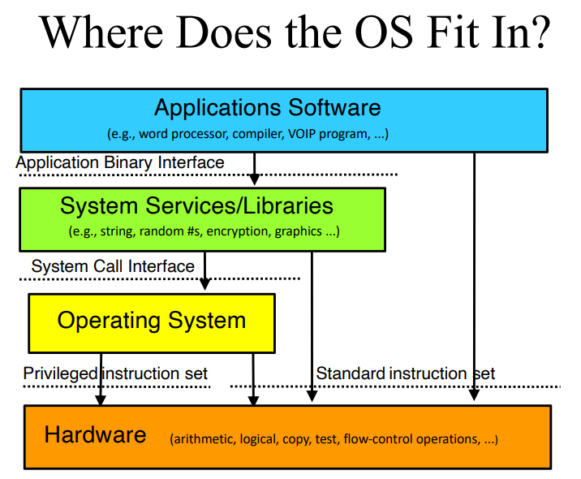

# Lecture 01 (01/10/2023): Introduction

## What is an Operating System?

### What is an OS?

* A system software intended to provide support for higher level applications, primarily user processes.
* "Its purpose is to *help* you run *other* software."
* A software that sits between the hardware and everything else, hiding the nasty details.
* Allows easy, safe, fair use and sharing of resources.
* Practically every computing device has an operating system, even things like smart fridges. Anything with a CPU inside likely has an operating system.

### How do you work with an OS?

* You configure them for a particular purpose you have.
* You use their features when you write *programs*, from things as simple as "printing" to the console, dealing with file I/O, etc.
* You rely on *services* they offer including:
  * Memory management
  * Persistent storage
  * Scheduling and synchronization
  * Interprocess communications (IPC)
  * Security

### What Does an OS Do?

* Manages hardware for programs (allocation, sharing, execution, handling problems, etc.).
  * For example, dividing by zero safely *crashes your program* instead of bringing down your whole computer thanks to the OS.
* Abstracts hardware to make it easier for use and portability. It also optimizes performance.
  * For example, saving bytes in a buffer instead of writing it directly to disk to minimize performance overhead.
* Provides new abstractions for applications, making it easier for developers to write software programs intended to run atop the OS.

### What Does an OS Look Like?

Abstraction:

* CPU: bytes, shorts, pointers, adding, subtracting, etc.
* OS: files, processes, threads, devices, ports, etc.
* Applications: such objects and their services

The OS effectively *extends* a computer, creating a much richer virtual computing platform and more powerful operations.

## Why Learn Operating Systems?

Many hard problems have been tackled in the context of operating systems:
* How to coordinate separate computatinons
* How to manage shared resources
* How to virtualize hardware and software
* How to organize communications
* How to protect your computing resources

Notice that this list is very general. The operating system solutions are often applicable to programs and systems you write, so understanding them is useful to have in your toolbelt.

## General OS Wisdom

Stuff we can learn from what has been applied to developing operating systems.

### Interface vs. Implementation

An important concept is to separate the **interface** (what the user interacts with, "porcelain") and the **implementation** (how it is constructed under the hood, "plumbing").

**Interfaces** are formal definitions for how software/hardware components work.

**Implementations** are the code that achieves the expected effects defined by the interfaces.

* An implementation is *not* a specification.
* Many compliant implementations are possible for a certain interface.
* Therefore, do *not* depend on the implementation, as it may change.
* In contrast, an interface specification is a *contract* with the users.
* This is the basis for product/release **interoperability**.

> Occasionally companies like Microsoft change the interface for some important software. These changes are often *controversial*, but they can get away with it because they're a tech giant. If just anyone attempts to break this contract, their software is most likely going to become very unpopular

> People have software that works a particular way. Nobody wants to change because it's expensive, and everything already works. A good example of this is how most of the world still uses IPv4 instead of upgrading to IPv6. This exemplifies how hard it is to *change* an interface, *particularly* a network interface.
>
> Network protocols are very, *very* interface-dependent because both sides of a communication line have to agree on exactly how to encode and transmit some sequence of bits.

### Modularity and Functional Encapsulation

Hide complexity with an appropriate level of abstraction. This allows you to encapsulate certain aspects of the implementation and only have to worry about interacting with *that* module's **interface** instead of worrying about its internals. This takes a massive **cognitive load** off the developer and in turn makes code more maintainable and expandable.

**Spaghetti code** is when code becomes very messy due to poor complexity management. Features depend excessively on each other, so changes in one area of code could cause a cascade of unexpected changes, making the code very hard to maintain.

**Object-oriented programming (OOP)** is an example of modular programming. It's a convenient, easy-to-learn paradigm we often take for granted in the modern age with languages like Python, Java, C++, etc. The speed of processors these days are so fast that the overhead (extra instructions and redundancies introduced by abstraction) make negligible difference.

Operating systems don't use OOP however, and this is just because performance is of the utmost importance, so they need to use languages that give them a finer level of control (vs. abstraction), usually C.

### Separate Policy from Mechanism

* **Policy** determines what can/should be done. Example: scheduling.
* **Mechanism** implements basic operations to do it. Example: (how to implement scheduling). <!-- lol thanks -->
* Mechanisms shouldn't dictate or limit policies.
* Policies must be *changeable* without changing mechanisms.
* You define a policy and then implement some mechanisms for that policy.

This is kind of analogous to interface ("policy") vs. implementation ("mechanism"), I think?

"An interface is a specification description of your software and policies are like settings."

> Policy and mechanism example: absence or presence of **user interactivity** in a weather simulation vs. presentation slides. For the former, you don't have to worry about listening for events like mouse clicks, so you don't need to run any instructions related to it, allowing the simulation to take advantage of the full computing power. For the latter, displaying slides is interactive - the presenter may click the screen/move their laser pointer at unpredictable intervals. The OS would observe that scenario through its interface and *change its policy* to make sure such events are handled. I think? Kind of didn't listen too hard.

### Parallelism

**Parallelism** and **asynchronicity** are powerful and vital, but dangerous when used carelessly. This is often the source of **nondeterministic** errors.

This is often associated with multi-core processing, but it has been important since the topic of scheduling.

Parallelism is needed to implement the semblance of multiple things happening at the same time, like rendering a video game with shadows, character movement, etc.

### Some Other Points

View services as objects and operations, and behind every object is a **data structure**.

Performance and correctness are often at odds. One often needs to be sacrificed in favor of the other.

> There was a Linux kernel bug a while ago: "Dirty CoW" (copy-on-write). It was there because an existing implementation in the OS was wrong, but the chances of it malfunctioning was very small, so developers didn't fix it because it may have had a performance implication. People then figured out how to *exploit* this vulnerability.

<!-- Lecture 01 (Continued) - 01/12/2023 -->
## OS Privilege

At the library level, libc converts source code level system calls into binary system calls that can use the OS' API.

The operating system is the only layer in the abstractions that is allowed to use the **privileged instruction set** (in addition to the **standard instruction set**).

The OS is automatically loaded when the machine boots and should *always* be present while the computer is running, ready to run when it's needed. *The OS should NEVER crash because it if does, it takes everything with it.*

The OS isn't actually running *all the time*; it wold be a waste of computing power. It just needs to be *ready* to run, and it passively runs every so often for housekeeping tasks in addition to managing a computer's startup.

## Instruction Set Architectures (ISAs)

These describe the set of instructions supported by a computer, namely which bit patterns (opcodes) correspond to what operations.

They usually come in families. A program written for an ISA will run on any compliant CPU.

### Privileged vs. General Instructions

*Any* code running on the machine can execute **general instructions** *directly* (without requesting from the OS).

A processor must be put into a *special mode* to execute **privileged instructions.** These are instructions that do things that are "dangerous." A certain bit in a register must be set for the processor to execute such instructions, and if it's not, attempting to run them amounts to an error.

## Platforms

The complete set of hardware in the box, of which the OS is one part, and the OS runs atop this platform. The platform includes peripherals like network cards, speakers, etc. Functionality beyond user mode instructions.

A successful OS will run on many ISAs, meaning some customers cannot choose their ISA. This implies that the OS will *abstract* the ISA. This abstraction should make *minimal assumptions* about specific hardware. The OS shouldn't require you to have a specific screen size, specific mouse, etc.

## Binary Distribution Model

OSes are written in source but are typically **distributed** in binary, ready to runs. There are one or more binary distributions per ISA.

**Device drivers** can then be added **after-market**. These can be written and distributed by 3rd parties. Any one driver can work with many versions of the OS.

The first time the OS starts up, it gives you an opportunity to **configure** it.

### Binary Configuration Model

The idea is to eliminate manual/static configuration to enable on distribution to serve all users.

Automatic hardware discovery and resource allocation.

> **Busses** are pieces of hardware that transfer data from one place to another.

## What Functionality Is In the OS?

OS code is very expensive to develop and maintain.

The less code you write in the OS, the less bugs you add to the OS. Remember that the OS must never crash. You should have **as much as necessary, as little as possible** in the OS code.

> An operating system **kernel** is called a "kernel" because it should be small! This is not so true anymore these days, though.

There's a performance cost with moving between user code and operating system. If there is code that needs to make lots of OS requests, that functionality probably has good reason to be built straight into the OS instead.

## Conclusion

* Understanding operating systems is critical to understanding how computers work
* Operating systems interact directly with the hardware
* Operating systems rely on stable interfaces
